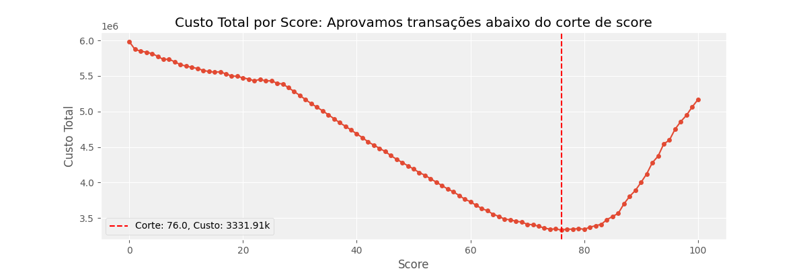
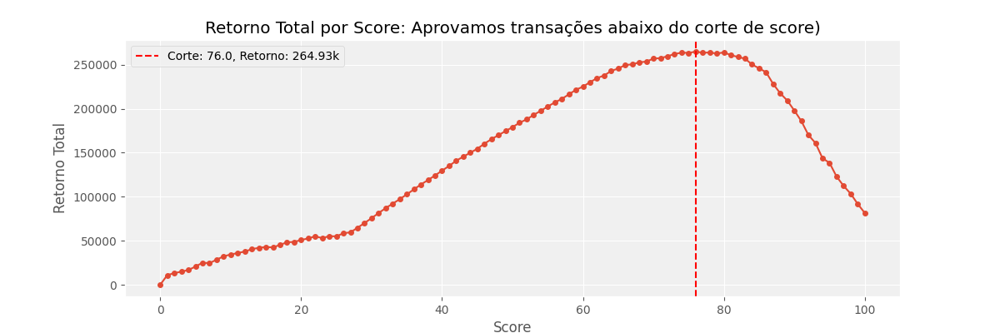
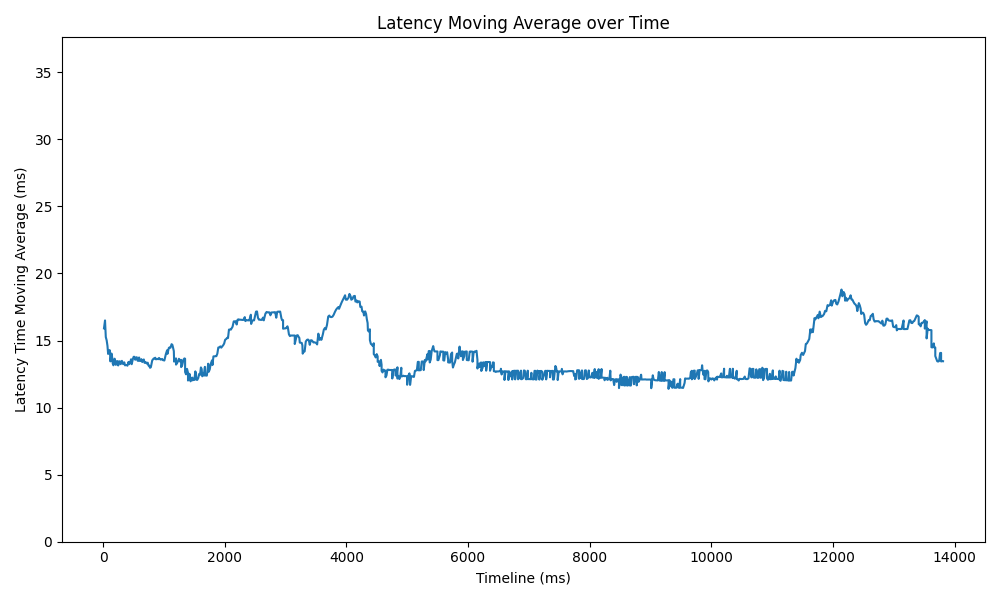
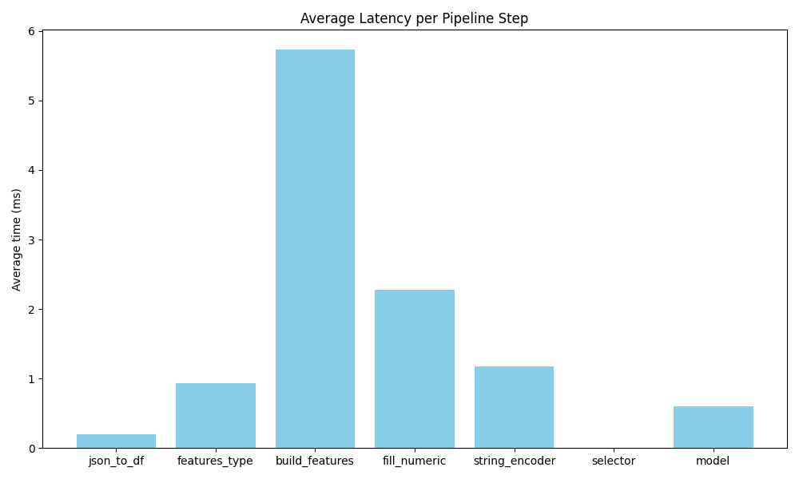

# meli-case-fraud

<a target="_blank" href="https://cookiecutter-data-science.drivendata.org/">
    
</a>

"Resolução do case MELI: Desafio Machine Learning"

## Respondendo as perguntas

### 1) Desenvolva um modelo para predizer a variável Fraude (1-Sim, 0-Não). Quais técnicas testou? Qual selecionou como melhor abordagem? Explique!

O desenvolvimento do modelo foi baseado na metologia CRISP-DM, iterativamente experimentei algumas técnicas para transformações dos dados e para desenvolvimento do modelo em sí. 

Destaque para o encoder e modelo selecionado:

#### Encoder: OptBinning
Este método funciona avaliando de forma otimizada os pontos de corte (bins) para cada variável, buscando maximizar a separação entre as classes de um problema binário. Ele utiliza algoritmos de otimização que consideram critérios de performance e estabilidade para definir as partições mais relevantes dos dados. Essa abordagem é vantajosa como encoder, pois automatiza o processo de discretização, preserva a informação discriminante e aumenta a interpretabilidade do modelo, além de potencialmente melhorar a performance na classificação.

#### Modelo: LightGBM
É um modelo de boosting poderoso e fácil de usar. É um modelo de voltado para escalabilidade, tem baixo consumo de memória o que é muito vantajoso no mundo de fraudes que em geral temos muitos dados, além de que tem um destaque para problemas de dados desbalanceados, como no nosso caso.

### 2) Compare o desempenho do seu algoritmo com o desempenho de um modelo anterior, cujo resultado é encontrado na coluna Score do dataset. Quais métricas usou e qual sua conclusão?

Para realizar a comparação de performance entre os modelos, foquei principalmente em:

- __ROC_AUC__: ótima métrica para comparação rápida de poder do modelo, independente do threshold.
- __ROC_AUC@0.01__: calculamos a área curva ROC, para um máx. FPR (impacto) de 1%.
- __Recall@0.01__: percentual de captura, para um máx. FPR (impacto) de 1%.
- __Precision@0.01__: percentual de precisão, para um máx. FPR (impacto) de 1%.

O modelo desenvolvido superou a perforamance do modelo vigente em todas as métricas:
| Métrica         | Score | New Score |
|-----------------|-------|-----------|
| ROC_AUC         | 0.73  | 0.77      |
| ROC_AUC@0.01    | 0.54  | 0.56      |
| Recall@0.01     | 0.13  | 0.13      |
| Precision@0.01  | 0.47  | 0.52      |


### 3) Como você pode garantir que o desempenho do modelo no laboratório vai ser um proxy para o desempenho do modelo em produção?

Para garantir que o desempenho do modelo no laboratório reflita sua performance em produção, adotamos estratégias como:

- Validação temporal: Utilizamos um conjunto de teste out-of-time (OOT), avaliando as últimas safras do dataset para garantir que o modelo generalize bem para novos períodos.
- Simulação de produção: Testamos o modelo em um ambiente de staging que replica as condições de produção, incluindo latência de resposta e disponibilidade das features.
- Monitoramento de distribuições: Avaliamos se as distribuições das variáveis no ambiente de treinamento são representativas das observadas em produção, usando métricas como KS (Kolmogorov-Smirnov) e PSI (Population Stability Index).
- Testes de robustez e adversariais: Avaliamos a estabilidade do modelo frente a possíveis perturbações ou mudanças no cenário de produção.

### 4) Supondo que o desempenho produtivo seja muito diferente do esperado, quais você acha que são as causas mais prováveis?

Se houver uma queda inesperada no desempenho do modelo em produção, algumas das causas mais prováveis incluem:

- Data Drift (Mudança na distribuição das variáveis de entrada):
    - Alterações nas distribuições das features em relação ao treinamento.
    - Mudança no perfil dos clientes/usuários ao longo do tempo.
    - Novas políticas ou regras de negócio que impactam os padrões de fraude.
    - Monitoramos isso com métricas como KS e PSI.

- Concept Drift (Mudança na definição do target):
    - Alterações nos critérios para definir fraudes, seja por mudanças no comportamento dos fraudadores ou ajustes nas regras da empresa.
    - Novos modus operandi da fraude.
    
- Problemas na ingestão ou processamento dos dados:
    - Features não disponíveis, desatualizadas ou calculadas incorretamente.
    - Erros no pipeline de engenharia de features, causando inconsistências.

- Questões de infraestrutura e consumo do modelo:
    - Latência excessiva na inferência, impactando a resposta online.
    - Falha na comunicação entre a API e os sistemas que consomem as predições.

Para diagnosticar a causa raiz, analisaríamos logs, métricas de produção e comparações entre a distribuição dos dados de treino e os dados reais de inferência.

#### Estabilidade das variáveis

<iframe src="reports/stability_report.pdf" style="width:100%; height:600px;" frameborder="0">
    Este navegador não suporta PDFs. Por favor, <a href="reports/stability_report.pdf" target="_blank">baixe o PDF</a> para visualizá-lo.
</iframe>

### 5) Com a informação adicional de que uma fraude custa 10 vezes mais para a empresa do que o bloqueio incorreto de um pagamento, o que você faria de diferente?

Sabendo que o custo de um fraude é 10 vezes maior que um bloqueio incorreto, utilizaria essa informação para ajustar o modelo e ter um melhor retorno. Por exemplo, poderia passar o peso das instâncias no treinamento (`sample_weight`), assim o modelo teria a penalidade ajustada para o que foi enunciado. Ou ainda podemos plotar a curva de score x custo, levando em consideração a proporção mencionada e assim escolher o corte que tenha menor custo.

Por exemplo, neste gráfico fizemos a análise do score do modelo atual, seguindo a segunda abordagem mencionada acima. Aprovamos aquelas transações abaixo do corte de score específicado pelo eixo X e obtemos um custo atribuido desta decisão, eixo Y.

- custo_fraude: soma do valor das fraudes abaixo do corte 
- custo_bloqueio_incorreto: soma do valor das boas transações acima do corte
- Objetivo: minimizar a equação abaixo (__minimizar o custo__):
$$custo\_total = custo\_fraude + custo\_bloqueio\_incorreto$$



> Para mais informações de como foi gerado a visualização: [01-baseline.ipynb](notebooks/01-baseline.ipynb)

### 6) Queremos encontrar o ponto de corte ideal para o modelo já treinado apresentado na parte (Score, onde 0 (zero) é o risco mais baixo e 100 (cem) o mais alto). Sabemos que MELI ganha 10% do valor de um agamento aprovado corretamente e a cada fraude aprovada perdemos 100% do valor do pagamento.Defina o ponto de corte que maximize os lucros do MELI, de forma que todos os pagamentos com menor Score sejam aprovados e os maiores sejam rejeitados.

Sabendo que nossa margem de lucro é 10% em cima das boas transações e que nosso custo da fraude é 100% do valor, temos que:

- custo_fraude: soma do valor das fraudes abaixo do corte 
- lucro_aprovadas_corretamente: soma do valor das boas transações abaixo do corte
- Objetivo: maximizar a equação abaixo (__maximizar o retorno__):
$$custo\_total = lucro\_aprovadas\_corretamente - custo\_fraude$$


> Para mais informações de como foi gerado a visualização: [01-baseline.ipynb](notebooks/01-baseline.ipynb)

### 7) Se o modelo precisar responder online, no menor tempo possível, o que isso mudaria suas decisões no item 1?

- Otimização da pipeline de pré-processamento:
    - Substituir transformações feitas em pandas por implementações em NumPy, scipy ou diretamente no scikit-learn, reduzindo a sobrecarga computacional.
    - Substituir modelo por outro mais simples.

- Uso de Feature Store:
    - Criar e armazenar features pré-calculadas para evitar reprocessamento desnecessário.
    - Utilizar ferramentas como AWS Feature Store, Feast ou Redis para servir as features rapidamente.

__Latência do modelo desenvolvido__:
> 
> 

### 8) Como colocar esse modelo em produção?

Para colocar este modelo em deploy, poderíamos utilizar o AWS SageMaker Endpoint, que permite hospedar e servir modelos de machine learning com alta escalabilidade e baixa latência. Essa abordagem possibilita a criação de endpoints gerenciados, facilitando o monitoramento e a atualização contínua do modelo em produção. Além disso, ao integrar o MLflow, podemos gerenciar o ciclo de vida do modelo, realizar o versionamento, rastrear experimentos e automatizar o deployment. Essa combinação assegura que o modelo esteja sempre atualizado, com métricas e logs monitorados, garantindo robustez e agilidade no ambiente de produção.

## Project Organization

```
├── LICENSE            <- Open-source license if one is chosen
├── Makefile           <- Makefile with convenience commands like `make data` or `make train`
├── README.md          <- The top-level README for developers using this project.
├── data
│   ├── external       <- Data from third party sources.
│   ├── interim        <- Intermediate data that has been transformed.
│   ├── processed      <- The final, canonical data sets for modeling.
│   └── raw            <- The original, immutable data dump.
│
├── docs               <- A default mkdocs project; see www.mkdocs.org for details
│
├── models             <- Trained and serialized models, model predictions, or model summaries
│
├── notebooks          <- Jupyter notebooks. Naming convention is a number (for ordering),
│                         the creator's initials, and a short `-` delimited description, e.g.
│                         `1.0-jqp-initial-data-exploration`.
│
├── pyproject.toml     <- Project configuration file with package metadata for 
│                         src and configuration for tools like black
│
├── references         <- Data dictionaries, manuals, and all other explanatory materials.
│
├── reports            <- Generated analysis as HTML, PDF, LaTeX, etc.
│   └── figures        <- Generated graphics and figures to be used in reporting
│
├── requirements.txt   <- The requirements file for reproducing the analysis environment, e.g.
│                         generated with `pip freeze > requirements.txt`
│
├── setup.cfg          <- Configuration file for flake8
│
└── src   <- Source code for use in this project.
    │
    ├── __init__.py             <- Makes src a Python module
    │
    ├── config.py               <- Store useful variables and configuration
    │
    ├── dataset.py              <- Scripts to download or generate data
    │
    ├── features.py             <- Code to create features for modeling
    │
    ├── modeling                
    │   ├── __init__.py 
    │   ├── predict.py          <- Code to run model inference with trained models          
    │   └── train.py            <- Code to train models
    │
    └── plots.py                <- Code to create visualizations
```

--------

